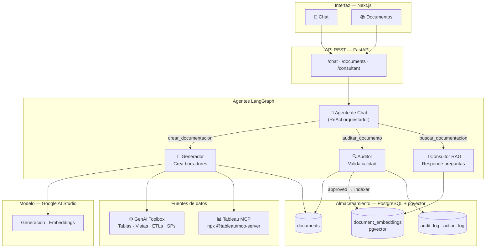
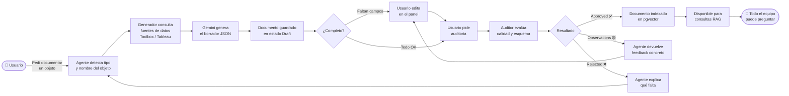

# memorIA

**Documentación inteligente para tu equipo empoderada con IA**


Genera, audita y permite consultar documentación de tablas, vistas, stored procedures y dashboards de Tableau — todo desde una interfaz de chat conversacional.
MemorIA es una solución barata para un problema común de la industria. No basta con establecer el mejor estándar de calidad de documentación si no es realmente alcanzable, o genera mucha fricción entre su creación y disponibilización. No hace todo pero, allana el camino.

Desarrollado y testeado sobre la API de **Google Gemini**. Gemini 2.5 Flash resultó más que suficiente para todas las tareas del sistema: generación de borradores, evaluación de calidad, embeddings y respuestas RAG.

---

## ¿De qué es capaz memorIA?

- **Generar borradores automáticos** — introspecciona el schema de una tabla, vista, stored procedure o dashboard y produce un documento estructurado con todos los metadatos que la IA puede inferir
- **Rellenar solo lo que puede** — los campos que requieren juicio humano (dominio de negocio, owner, descripción de negocio) los deja en blanco con instrucciones claras para el usuario
- **Auditar calidad** — evalúa cada campo contra criterios de calidad definidos y devuelve aprobación, observaciones concretas o rechazo con explicación
- **Indexar en pgvector** — al aprobar un documento, lo embebe y lo almacena para búsqueda semántica
- **Responder preguntas sobre los datos** — sistema RAG que responde basándose exclusivamente en la documentación aprobada
- **Editar inline** — panel lateral con viewer y editor de documentos sin salir del chat
- **Exportar a PDF** — descarga con el mismo diseño del viewer
- **Conectar múltiples bases de datos** — via GenAI Toolbox (PostgreSQL, MySQL, SQLite, BigQuery, Spanner)
- **Documentar dashboards de Tableau** — via Tableau MCP Server
- **Estructura extensible** — agregar un campo o un tipo de objeto nuevo requiere editar un solo archivo (`config/doc_spec.py`)

---

## Arquitectura de agentes



---

## Flujo de usuario



---

## Opción A — Docker (recomendado)

### Requisitos
- [Docker Desktop](https://www.docker.com/products/docker-desktop/) corriendo

### Pasos

```bash
# 1. Configurar variables de entorno
cp .env.example .env
# Editar .env con tus valores reales

# 2. Descargar la base de datos de desarrollo
curl -L -o dev_data/northwind.db https://raw.githubusercontent.com/jpwhite3/northwind-SQLite3/main/dist/northwind.db

# 3. Levantar todo
docker compose up --build
```

Docker instala automáticamente todas las dependencias (Python, Node.js, Playwright, GenAI Toolbox, PostgreSQL). No necesitás instalar nada más.

| Servicio | URL |
|---|---|
| Frontend | http://localhost:3000 |
| API | http://localhost:8000 |
| GenAI Toolbox | http://localhost:5000 |
| PostgreSQL | localhost:5432 |

---

## Opción B — Manual (sin Docker)

### Requisitos
- Python 3.11+
- Node.js 18+
- PostgreSQL 15+ con la extensión [pgvector](https://github.com/pgvector/pgvector) instalada
- Binario de [GenAI Toolbox](https://github.com/googleapis/genai-toolbox) en el PATH

### Pasos

```bash
# 1. Entorno virtual e instalación de dependencias
python -m venv .venv
.venv\Scripts\activate        # Windows
# source .venv/bin/activate   # macOS/Linux
pip install -r requirements.txt
playwright install chromium

# 2. Dependencias del frontend
cd frontend && npm install && cd ..

# 3. Configurar variables de entorno
cp .env.example .env
# Editar .env con tus valores reales

# 4. Descargar la base de datos de desarrollo
curl -L -o dev_data/northwind.db https://raw.githubusercontent.com/jpwhite3/northwind-SQLite3/main/dist/northwind.db
```

Luego levantar 3 terminales en paralelo:

```bash
# Terminal 1 — GenAI Toolbox
toolbox --config dev_data/toolbox_dev.yaml

# Terminal 2 — API
uvicorn api.main:app --reload

# Terminal 3 — Frontend
cd frontend && npm run dev
```

---

## Variables de entorno

Ver `.env.example` para la lista completa. Las más importantes:

| Variable | Descripción |
|---|---|
| `GEMINI_API_KEY` | API key de Google AI Studio |
| `DATABASE_URL` | Conexión a PostgreSQL — en Docker se configura automáticamente |
| `TOOLBOX_URL` | URL donde corre GenAI Toolbox (default: `http://localhost:5000`) |
| `TABLEAU_SERVER_URL` | URL base del servidor Tableau |
| `TABLEAU_SITE` | Site ID — **solo Tableau Cloud**, omitir en Server on-premise |
| `TABLEAU_TOKEN_NAME` / `TABLEAU_TOKEN_VALUE` | Personal Access Token de Tableau |

---

## Base conceptual — DAMA DMBOK e ISO

La estructura de documentación está basada en los estándares de la industria:

- **DAMA DMBOK v2** *(Data Management Body of Knowledge)* — Define las categorías de metadatos que debe tener un activo de datos: identificación, descripción de negocio, metadata técnico, linaje, gobernanza y ciclo de vida. Las secciones de cada documento en memorIA mapean directamente a estas categorías.
- **ISO/IEC 11179** — Estándar para registros de metadatos. Define cómo nombrar, clasificar y describir elementos de datos de forma inequívoca. Influye en los campos `physical_name`, `business_name` y `business_description`.
- **ISO/IEC 25012** — Modelo de calidad de datos. Los criterios de calidad del auditor (completitud, consistencia, precisión de descripciones) se derivan de las características de calidad definidas en este estándar.

---

## Documentación técnica

| Tema | Documento |
|---|---|
| Cómo se relacionan los agentes entre sí | [docs/architecture.md](docs/architecture.md) |
| Flujo de usuario detallado | [docs/user-flow.md](docs/user-flow.md) |
| Conectar una base de datos (GenAI Toolbox) | [docs/connect-database.md](docs/connect-database.md) |
| Conectar Tableau | [docs/connect-tableau.md](docs/connect-tableau.md) |
| Modificar la estructura de un documento | [docs/doc-structure.md](docs/doc-structure.md) |
| Agregar un nuevo tipo de objeto | [docs/add-object-type.md](docs/add-object-type.md) |

---

## Estructura del proyecto

```
├── agents/          # Agentes LangGraph (generador, auditor, consultor, chat)
├── api/             # API REST FastAPI
├── config/          # Fuente de verdad del schema de documentación
├── db/              # Cliente PostgreSQL (psycopg2) y schema SQL
├── dev_data/        # SQLite de desarrollo y config de GenAI Toolbox
├── docs/            # Documentación técnica detallada
├── frontend/        # UI Next.js
├── tools/           # Clientes MCP (GenAI Toolbox y Tableau)
└── workers/         # Worker de indexación RAG
```
